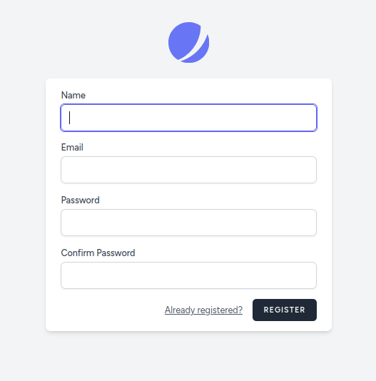
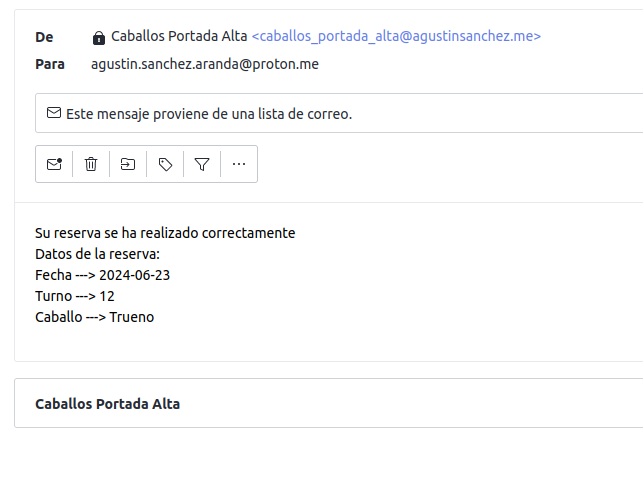

# TAREA FINAL PSP. PASEOS A CABALLO EN LARAVEL.

En esta tarea vamos a hacer uso del VPS de DigitalOcean que llevamos todo el curso configurando. Tenemos instalado LEMP(Ubuntu, Nginx, php, mysql). Lo que se pide es montar una web de reservas de paseos de caballo, donde la información se guardará en una base de datos mysql, también se montará un servicio de API REST, para que desde una aplicación Android podamos hacer CRUD a la base de datos.  
  
 Para ello vamos a usar Laravel, framework de php, que nos proporciona diversas funcionalidades para el proyecto.
 
 He configurado un dominio y el protocolo https para acceder al servidor: 
 
 ### https://caballos.agustinsanchez.me
 
 Laravel nos presenta una arquitectura MVC, donde para las vistas nos ofrece una serie de plantillas (blade), en los modelos definimos nuestras tablas para crear la base de datos, ofrece un potente ORM, Eloquent, que nos facilita la gestión de la base de datos, y los controladores donde llevaremos a cabo la lógica de negocio de lo que queremos mostrar en las vistas.

Otro aspecto a mencionar en Laravel es el sistema de rutas, que nos permite navegar facilmente entre las distintas vistas de nuestro proyecto.

Paso a explicar el funcionamiento de la web.
 
 
Al acceder al dominio lo primero que vemos es una pantalla de bienvenida:

en la cual podemos hacer login, o registrarnos si no hemos accedido nunca al sistema. 

 

Al registrarnos se nos mandará un email al correo para realizar la verificación sin esta verificación no podremos logearnos.  
El servicio de mail lo he configurado haciendo mail relay con Brevo.

Una vez dentro como usuario autenticado vemos una pantalla de inicio donde se muestra una bienvenida y una descripción sobre los paseos a caballo.  
En la parte superior podemos observar una barra de navegación para desplazarnos por las distintas vistas.

En nuestro caballos se muestran los datos de los caballos que dispone la hípica y debajo unos cards con la foto de cada uno.  
 
 

En Reservas se mostrarán todas las reservas pertenecientes al usuario logueado, se muestran ordenadas por fecha y turno. Quiero mencionar que lo que se muestra es la tabla reservas de la base de datos, en la tabla reservas no se guarda el nombre del caballo sino su id, para mostrarlo he implementado las relaciones 1 a N en la base de datos a través de Laravel, entonces en la misma vista puedo llamar a un método de esta relación y me trae en nombre del caballo a partir de su id.
Esta es la vista de reservas:

 
 Aqui podemos agregar una reserva o editarla nos aparecerán una de estas dos vistas según lo que seleccionemos 
 
  

En estas vistas para comenzar sólo dejo que se pueda seleccionar la fecha deseada, que será dentro de los 30 días siguientes y sólo los fines de semana, los demás dias los muestro desactivados por tanto serán imposibles seleccionarlos, no hay error posible.

Una vez que selecciono la fecha me dejará seleccionar turno (caballo aún no), según la fecha se calcularán dinamicamente los turnos que quedan ese día. Una vez que seleccionamos el turno ahora sí podremos elegir caballo que también se calculan dinamicamente y se nos mostrarán los caballos disponibles para ese día y turno, los no ocupados y no enfermos.
También hay un campo comentario.
Cuando editamos se recupera la fecha y el comentario.

En reservas también se nos permite borrar la reserva, mostrando un mensaje de confirmación.

Cada vez que se realiza una reserva, se edita o se elimina recibiremos en nuestro correo un email de información.

### creacion de la API REST

la siguiente parte de la tarea nos lleva a la creación de una API REST para realizar todas las tareas que hacemos vía Web a través de una aplicación Android. Laravel nos ayuda al desarrollo ofreciéndonos buena documentación y facilidad de creación. A grandes rasgos lo que creamos es un sistema de rutas conectadas con métodos de un controlador que llevarán a cabo las tareas que necesitemos. 

He creado más consultas API de las necesarias a modo de practica e investigación por si algún día son necesarias, no obstante voy a pasar a documentar las que he usado en mi aplicación Android.

- POST  https://caballos.agustinsanchez.me/api/register

se le pasa un body con name, email, password, confirm_password
nos devolverá un token y el name del usuario

ojo tras esta petición se nos manda correo de confirmación que hemos de aceptar para continuar.

- POST https://caballos.agustinsanchez.me/api/login

se le pasa en el body email, password
nos devuelve el token y el name del usuario
con esta consulta ya estaríamos logueados en el sistema

A partir de ahora todas las consultas necesitarán el token.

- GET https://caballos.agustinsanchez.me/api/reservas

No se le pasa nada y nos devuelve todas las reservas del usuario autenticado.

- POST https://caballos.agustinsanchez.me/api/reservas

en el body se le pasa caballo, fecha_reserva, turno, comentario

esta consulta nos inserta una reserva y nos devuelve los datos de la reserva insertada.

- PUT https://caballos.agustinsanchez.me/api/reservas/id

como parámetros lleva caballo, fecha_reserva, turno, comentario

hace el update de una reserva y nos devuelve los datos de la reserva actualizada. 

- DELELTE https://caballos.agustinsanchez.me/api/reservas/id

no se le pasa nada, devuelv un array vacío, nos borra de la bd la reserva de la id.

- POST https://caballos.agustinsanchez.me/api/reservas/turnos-disponibles

se le pasa en el body la fecha de una reserva y nos devolverá los turnos disponibles en esa fecha.

- POST https://caballos.agustinsanchez.me/api/reservas/caballos-disponibles

le pasamos en el body fecha_reserva y turno y nos devuelve los caballos disponibles para ese dia y hora.

- POST https://caballos.agustinsanchez.me/api/logout

no se le pasa nada y nos hace logout del sistema.

### panel de administración

una de las mejoras pedidas era la del panel de administración. He usado Orchid, está configurado para que un usuario administrador pueda acceder a la tabla de usuarios, de reservas o de caballos y modificarla como quiera.

He generado formularios para la insercción de registros en la tabla que se desee.

   

### tabla historial
otra mejora pedía la creación de una tabla llamada historial que almacenara las reservas ya vencidas por fecha de la tabla reservas. Para solucionar esto podía haber usado Laravel que tiene un programador de tareas, pero he optado por usar el programador de tareas de mysql, mi razonamiento ha sido que para realizar una misma tarea mejor que lo haga directamente mysql y no meter de intermediaria otra tecnología perdiendo eficiencia, no obstante mencionar la posibilidad que ofrece Laravel para programar tareas. 

Para realizalo primero cree la tabla historial, similar a la tabla reservas, y luego diseñe un script sql para insertarlo en el programador de tareas de mysql. Este es el script.

muestro su correcto funcionamiento en Orchid donde también podremos, como administradores, consultar y modificar dicha tabla.  

